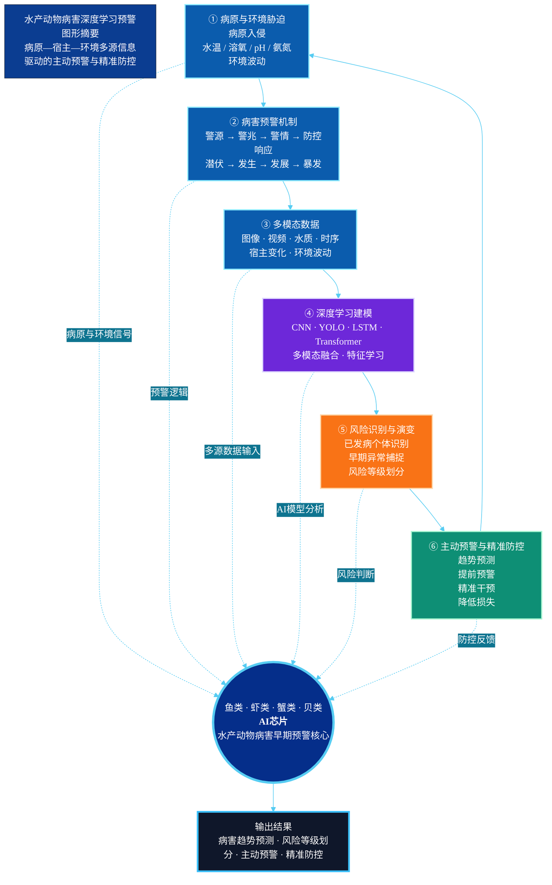

```mermaid
%%{init: {"theme":"base","themeVariables":{"fontFamily":"Microsoft YaHei","primaryColor":"#0B3D91","primaryTextColor":"#ffffff","lineColor":"#56CCF2","secondaryColor":"#0E7490","tertiaryColor":"#EAF6FF","background":"#EAF7FF"}}}%%
flowchart TB

T["水产动物病害深度学习预警图形摘要<br/>病原—宿主—环境多源信息驱动的主动预警与精准防控"]

CORE(("鱼类 · 虾类 · 蟹类 · 贝类<br/><b>AI芯片</b><br/>水产动物病害早期预警核心"))

A["① 病原与环境胁迫<br/>病原入侵<br/>水温 / 溶氧 / pH / 氨氮<br/>环境波动"]
B["② 病害预警机制<br/>警源 → 警兆 → 警情 → 防控响应<br/>潜伏 → 发生 → 发展 → 暴发"]
C["③ 多模态数据<br/>图像 · 视频 · 水质 · 时序<br/>宿主变化 · 环境波动"]
D["④ 深度学习建模<br/>CNN · YOLO · LSTM · Transformer<br/>多模态融合 · 特征学习"]
E["⑤ 风险识别与演变<br/>已发病个体识别<br/>早期异常捕捉<br/>风险等级划分"]
F["⑥ 主动预警与精准防控<br/>趋势预测<br/>提前预警<br/>精准干预<br/>降低损失"]

A --> B --> C --> D --> E --> F --> A

A -. 病原与环境信号 .-> CORE
B -. 预警逻辑 .-> CORE
C -. 多源数据输入 .-> CORE
D -. AI模型分析 .-> CORE
E -. 风险判断 .-> CORE
F -. 防控反馈 .-> CORE

CORE --> O["输出结果<br/>病害趋势预测 · 风险等级划分 · 主动预警 · 精准防控"]

classDef center fill:#052E8A,stroke:#56CCF2,stroke-width:4px,color:#ffffff;
classDef blue fill:#0B5CAD,stroke:#8EEBFF,stroke-width:2px,color:#ffffff;
classDef green fill:#0E8F75,stroke:#A7F3D0,stroke-width:2px,color:#ffffff;
classDef orange fill:#F97316,stroke:#FED7AA,stroke-width:2px,color:#ffffff;
classDef purple fill:#6D28D9,stroke:#DDD6FE,stroke-width:2px,color:#ffffff;
classDef output fill:#0F172A,stroke:#38BDF8,stroke-width:3px,color:#ffffff;

class CORE center;
class A,B,C blue;
class D purple;
class E orange;
class F green;
class O output;
  
```